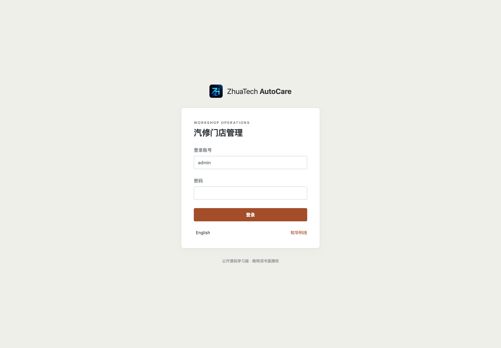
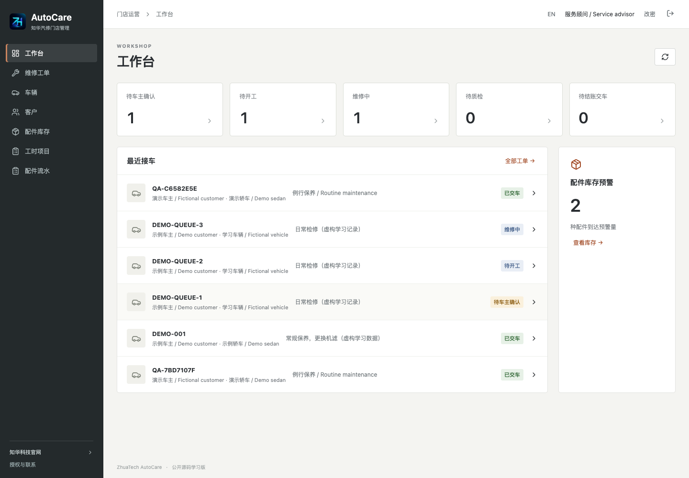
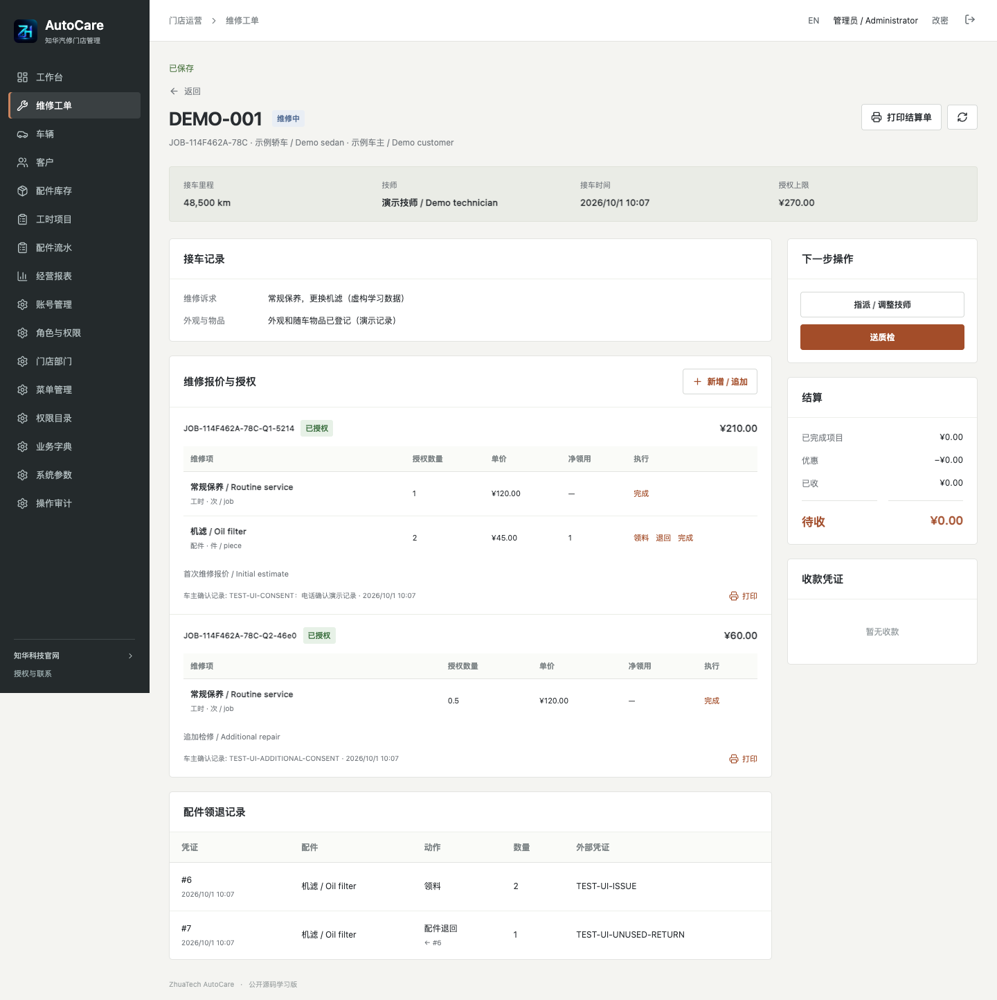
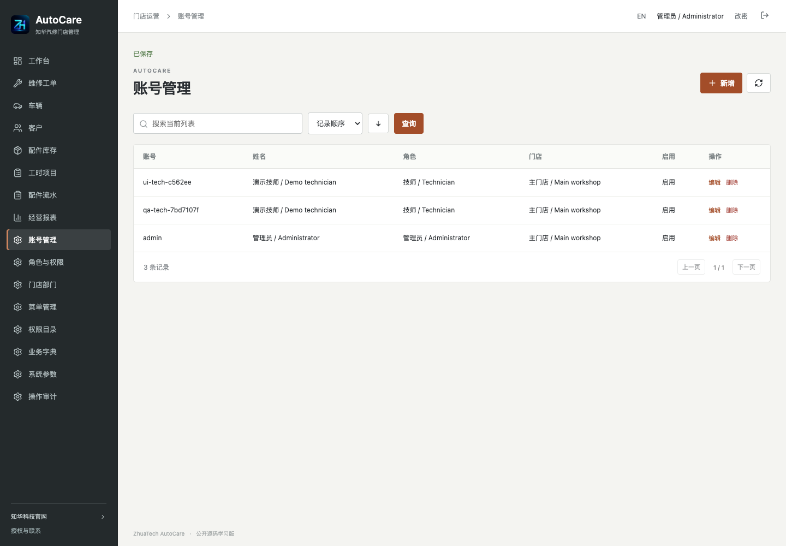
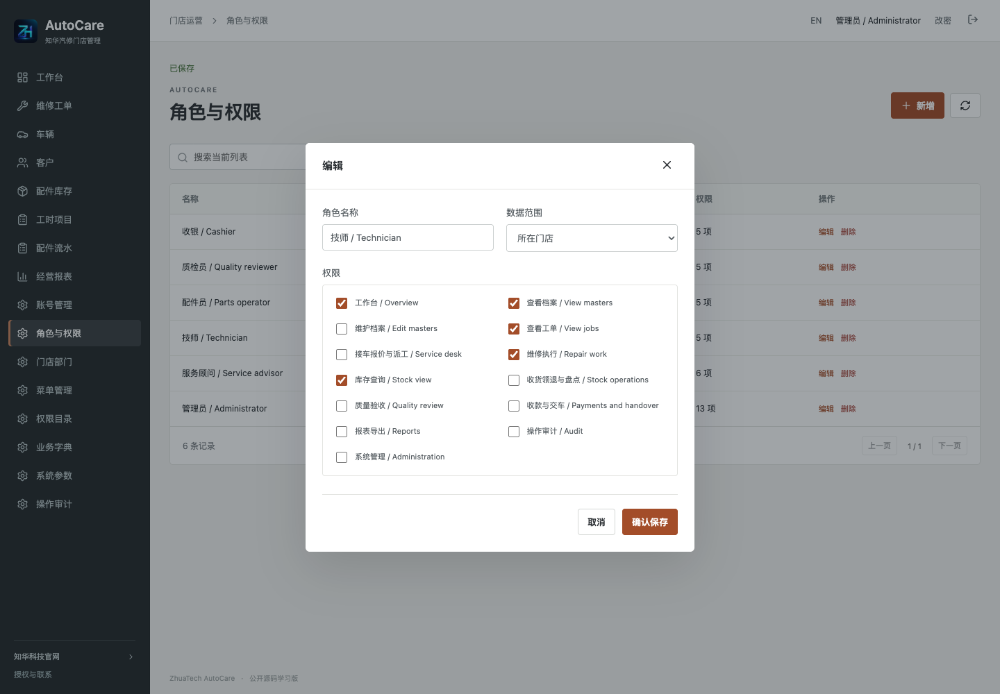
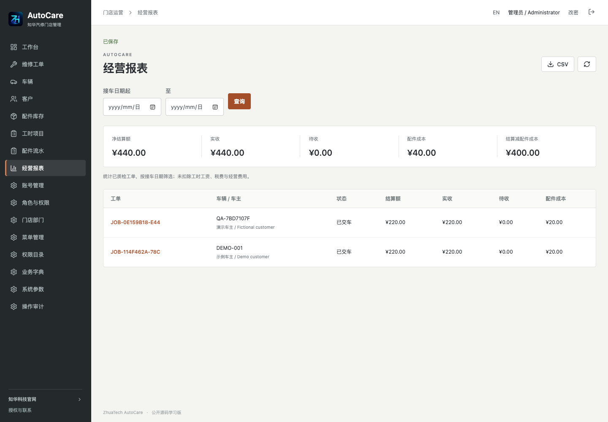
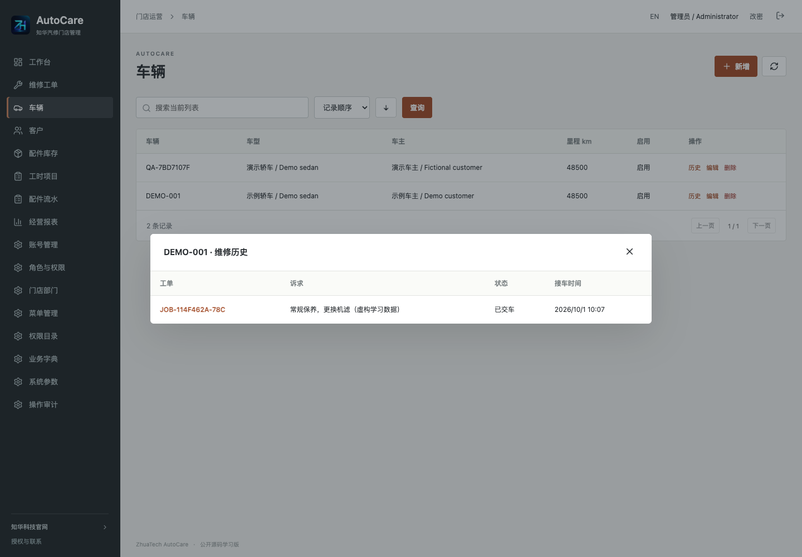
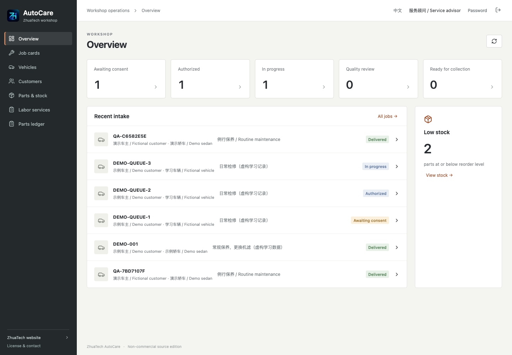
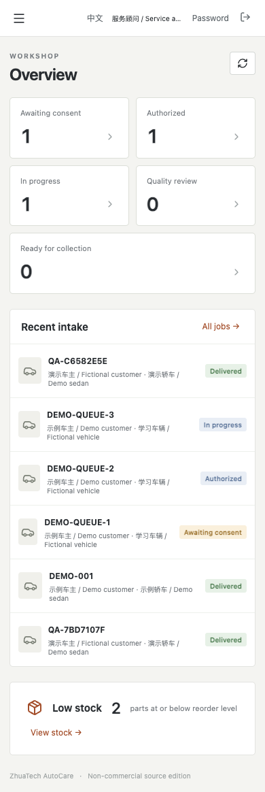

[中文](README.md) | [English](README.en.md)

<p></p>

# 知华科技汽修门店管理 · ZhuaTech AutoCare

**公开源码学习版 · Non-commercial source edition**

一张车辆工单，从接车、维修报价、车主确认到技师派工、配件领退、质检、收款和交车。面向独立汽修门店及软件实施团队的学习评估，采用 Java 21、Spring Boot、Vue 3 与 MySQL，提供可运行的前后端源码和中英文界面。商业授权、收费部署及商业二次开发须取得书面授权。

知华科技（上海如静知华信息科技有限公司） · [官网](https://www.zhuatech.cn/) · 微信 `zhuatech` / `zhuatech2`。

英文主页：[README.en.md](README.en.md)。

## 一辆车如何走完流程

服务顾问建立车主和车辆档案，登记公里数、维修诉求及接车外观。同一车辆不能同时建立两张未结束工单，里程不能倒退。工单保存车辆和车主快照，不随之后的档案改名而改变。

报价中的工时与配件保存名称、单位、数量和价格快照。提交后不能改价；顾问核实车主的电话、纸质或其他外部确认后填写凭据，再登记同意。**这里是人工确认记录，没有客户在线审批或电子签名**。新增维修内容建立独立追加报价，另行确认；未经接受的报价不能领料或计费，未处理的追加报价会阻止送质检。

指派同门店的启用技师后开工。配件员按授权上限领料，未使用的配件须引用原领料凭证退回，以原成本恢复库存。技师核对实物后完成维修项：工时按约定数量计费，配件按净领用量计费；配件不足授权数量可以完成并说明，未领用部分不收费。完成后的维修项冻结，不能继续领退料。

所有已接受维修项完成后送质检。质检员实际检查车辆，填写通过或退回记录；系统不会代替物理检验。通过后收银核对实际收款凭据，支持分次收款和交车前原收款冲销。未足额结清不能交车。交车记录保留领取凭据，历史工单不可抹除。

## 已实现功能

| 模块 | 实际能力 |
| --- | --- |
| 客户、车辆 | 新增、编辑、删除、启停、车主归属、里程保护、按权限查看车辆维修历史 |
| 工时、配件 | 参考项目、基本单位、参考售价、库存预警、引用保护、配件 JSON 原子批量导入 |
| 接车与维修工单 | 接车记录修改、状态筛选、派工、开工、作废；同车未结工单检查 |
| 报价与追加授权 | 草稿修改/删除、提交冻结、人工记录同意/拒绝；已接受报价独立累计，不覆盖原授权 |
| 配件库存 | 收货、移动平均成本、按授权领料、原领料退回、带账面数量和价值快照的盘点、不可变流水 |
| 维修与质检 | 已派技师执行、逐项完成、未完成及未确认报价拦截、人工质检通过/退回 |
| 收款与交车 | 实际收款登记、分次收款、原收款冲销、优惠、待收余额、结清拦截、交车记录 |
| 查询与交付 | 工作台、搜索/排序/分页、按接车日期的报表、CSV 导出、报价/结算打印 |
| 管理端 | 账号、密码、岗位角色、实时权限、部门范围、注册菜单配置、字典、参数、审计 |
| 运行保障 | 空库 Flyway 迁移、健康检查、Compose、前后端测试、备份恢复说明 |

初始化提供服务顾问、技师、配件员、质检员、收银与管理员角色。管理员创建独立员工账号并分配岗位；技师岗位仅能查看派给自己的工单，其他岗位按部门范围查看。工单操作、后台管理及直接 HTTP 请求都检查权限；隐藏菜单不代替后端授权。

## 适用边界和未实现项

单公司、单币种、配件基本单位、每部门一套库存。配件收货是实际入库记录，不包含供应商应付、采购审批或税务分录。授权报价是上限，实际结算按已完成工时和已用配件计算。库存成本及“结算减配件成本”不包含工时工资、税费、经营费用，不能当成税务利润。

未实现：预约排班、维修后保养提醒、工时计时器、VIN 外部解码、OCR、车场定位、自动诊断、保险理赔、税务发票、扫码支付、线上车主审批、电子签名、附件上传、多法人/多租户 SaaS、跨部门调拨、批次/序列号、总账、交车后退款及返修关联。VIN 字段是可选文本，不验证车辆身份。登记授权时须保管相应的外部证明，系统不验证其真实性。

质检退回可补充新的维修记录或独立追加报价；已完成项目不能重写，返工计费须经新报价授权。交车前可以冲销录错的收款，**冲销不执行银行退款**；交车后本版冻结业务和财务动作，线下退款/售后需独立记录并进行专项扩展。付款接口不对接支付渠道。

所有业务与管理写操作通过数据库锁串行化，适用于小团队。每类参考数据、工单、流水和审计读取上限 10,000 条，超限明确拒绝，不生成截断报表。尚未进行大型负载或真实门店长期试运行验收。没有虚构商用客户或成交承诺。

## 实际运行截图

以下截图来自运行系统，档案与凭证是虚构学习数据。登录页提供中英文入口；业务工作台显示维修状态、最近工单和配件预警。

| 登录 | 业务端工作台 |
| --- | --- |
|  |  |

工单详情展示接车事实、独立报价授权、派工、领退料和逐项完成操作。



管理端账号页维护员工、岗位和部门；角色权限页配置注册功能与数据范围，接口独立检查授权。

| 账号管理 | 角色与权限 |
| --- | --- |
|  |  |

经营报表按接车日期汇总已质检工单、收款与配件成本，支持 CSV 导出。



车辆历史显示当前账号可查看的历史工单，不向未获授权的技师开放其他派工。



中英文与窄屏页面使用同一套实际业务界面：





## 技术与架构

Java **21**、Spring Boot **4.0.7**、Spring Security、JPA、Flyway；Vue **3.5.40**、Vite **8.1.5**、Node.js **24.19.0 或以上**；MySQL **8.4**；Nginx **1.29**；Docker Compose v2。精确依赖见 `pom.xml` 与前端锁文件。

浏览器 → Nginx 同源代理 `/api` → Java → MySQL。后端每次读取数据库中当前角色和账号状态；会话 HttpOnly、SameSite Strict，写请求有 CSRF 检查。BCrypt 12 轮散列、登录失败限流、30 分钟空闲会话。库存和收款写入有请求标识及内容检查，事务失败整笔回滚。

```text
backend/    接车、授权、维修、库存、资金、管理、认证与测试
  src/main/resources/db/migration/    版本化数据库脚本
frontend/   中英文业务端/管理端、品牌素材与 Nginx
compose.yaml   健康依赖、端口覆盖与数据库持久化卷
.env.example   配置名称，不含真实凭证
docs/       操作、架构、部署、英文说明与截图
scripts/    真实 MySQL 流程与发布检查
LICENSE     自有源码非商业许可
```

数据库 `zhuatech_autocare`：19 个业务/管理表和 1 个 Flyway 历史表。建表、索引、外键、数量约束位于 `backend/src/main/resources/db/migration/V1__workshop_schema.sql`；JPA 仅做结构校验。首次初始化管理目录、岗位、字典、参数与管理员，重启不覆盖已有数据。详见 [架构与接口](docs/ARCHITECTURE.md)。

## 安装与首次登录

```sh
cp .env.example .env
# 填写 MYSQL_ROOT_PASSWORD、DATABASE_PASSWORD、ADMIN_PASSWORD 三个独立强密码。
docker compose config --quiet
docker compose up -d --build --wait
```

默认管理员账号 **admin**。密码来自 **ADMIN_PASSWORD**，12–72 位，包含大小写字母和数字，没有通用默认密码；UTF-8 编码不超过72字节。修改环境变量不会重置已存在账号，员工密码通过后台管理和修改密码功能维护。

前端 `http://127.0.0.1:8097/`；健康检查 `http://127.0.0.1:8097/actuator/health`。后端和数据库不暴露宿主机端口。默认只绑定本机；端口冲突设置 `WEB_PORT`，无需停止其他系统。

| 配置 | 用途 |
| --- | --- |
| `MYSQL_ROOT_PASSWORD` / `DATABASE_PASSWORD` | 数据库管理员和业务账号密码，必填 |
| `ADMIN_USERNAME` / `ADMIN_PASSWORD` | 首次空库管理员账号与密码 |
| `SEED_DEMO` | 空库是否加入虚构主数据，默认 false |
| `WEB_PORT` / `BIND_ADDRESS` | 默认 8097 / 127.0.0.1 |
| `COOKIE_SECURE` | HTTPS 部署设为 true，本机 HTTP 为 false |
| `DATABASE_URL` / `DATABASE_USER` | 直接运行后端时覆盖数据库连接 |

`SEED_DEMO=true` 仅在空库加入虚构车主、车辆、工时与配件，不伪造库存、维修、收款或员工账号。管理员先创建技师等员工，配件员按实际凭证收货，再走完整维修流程。

系统参数可调整公司名称、时区及两位小数币种；产生任何工单或库存流水后不能切换币种，没有自动换汇。

本地开发须有 Java 21、Maven 3.9、Node.js 与独立 MySQL，配置数据库和管理员环境变量：

```sh
cd backend
mvn spring-boot:run
```

另一个终端从仓库根目录启动前端：

```sh
cd frontend
npm ci
npm run dev
```

开发前端 5173，代理本机后端 8080。生产经 Nginx 容器服务名访问后端，支持 SPA 路径回退；页面不写死 localhost API。Docker Maven 构建执行测试，不跳过测试。

## 操作、部署、升级与备份

- [操作手册](docs/OPERATIONS.md)：接车、追加授权、领退料、质检、收款交车及错误处理。
- [部署与恢复](docs/DEPLOYMENT.md)：HTTPS、端口、数据库、独立恢复、升级与故障日志。
- [架构与接口](docs/ARCHITECTURE.md)：数据、状态、计价与 API 输入说明。
- [English guide](docs/ENGLISH.md)：installation and workshop workflow.
- [第三方许可](docs/THIRD_PARTY.md)：依赖的独立版权和许可。

主动重启时，先重启 MySQL 并等待健康，再重启后端并等待健康，最后重启前端，使其代理重新解析后端地址。

升级前备份并验证恢复；后续迁移只新增版本文件，不修改已运行的脚本。Flyway 校验失败时核对日志、版本与备份，不能删除迁移历史或用自动建表绕过。不要对真实业务执行 `down -v`。

公网须可信 HTTPS 代理、`COOKIE_SECURE=true` 和受控业务账号。公共演示必须另行隔离数据、防滥用及安排清理，本仓库不提供演示租户。数据库驱动 MariaDB Connector/J 3.5.10 连接 MySQL 8.4；Compose 隔离内网使用 `sslMode=trust`，外部数据库应使用 TLS、可信 CA 与 `sslMode=verify-full`。

## 测试与验收

```sh
cd backend
mvn spotless:check test package
cd ../frontend
npm ci
npm run format:check
npm run lint
npm test
npm run build
cd ..
docker compose config --quiet
python3 scripts/release-check.py
git diff --check
# 独立学习/验收环境，已设置 BASE_URL、ADMIN_PASSWORD 时：
python3 scripts/smoke.py
```

后端测试包括完整维修、独立追加授权、原单退料成本、支付冲销、未结清交车、原子导入、并发防超领、CSRF、岗位及部门范围。集成测试使用 H2 MySQL 兼容模式；真实 MySQL 空库、浏览器和备份恢复另行验收，结果见 [验收记录](docs/VALIDATION.md)。不将未执行检查标为通过。

## 安全、反馈与授权

`.env`、真实密码、备份、客户资料和日志不提交。登录限流和会话目前为单进程；多实例需共享会话及统一限流。不要共享管理员或直接暴露业务库。客户端不接收密码散列，审计不保存密码或完整请求载荷。

401 重新登录；403 检查角色、部门、派工和 CSRF；409 核对状态、余额、库存、原领料、盘点快照及引用。网络超时先查原凭证，在仍允许该动作的状态下使用同一请求标识和相同内容重试；状态已经变化时以台账为准，不能重复登记实际款项。资源超限需要升级查询，不能理解为无数据。

仓库 Issues / PR 可提交可复现问题、业务说明及经过脱敏的材料。贡献须说明验证与依赖许可。安全问题通过官网或微信私下反馈，不公开敏感日志。软件按现状提供，企业适用性、实施和支持范围以书面协议为准。

自有代码使用根目录 [LICENSE](LICENSE)，是非商业公开源码学习版，**不是 OSI 标准开源许可**。第三方依赖保留其版权和许可。

## 联系知华科技

商业授权或深度定制开发请联系知华科技。

本项目由知华科技（上海如静知华信息科技有限公司）提供公开源码学习版本，主要用于个人学习、技术研究与非商业交流。未经书面授权不得商用。企业信息化建设、中小企业数字化转型、中小企业 AI 转型、私有化部署、软件外包、软件项目外包、软件实施、FDE 外包、OPC 技术支持及深度定制开发，请访问知华科技官网 [https://www.zhuatech.cn/](https://www.zhuatech.cn/)，或添加微信 zhuatech、zhuatech2 咨询。

<table><tr><td align="center"><br>微信：zhuatech</td><td align="center"><br>微信：zhuatech2</td></tr></table>
